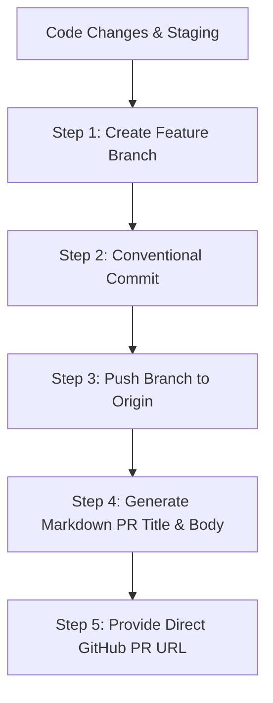

# GitHub Pull Request Generator Skill

This skill documents the mandatory end-to-end standard operating procedure for creating, structuring, formatting, and submitting GitHub Pull Requests for the GEMMA Plugin repository and related sub-packages.

---

## Workflow Overview



---

## Step 1: Feature Branch Naming Protocol

Branch names must be clean, lowercase, hyphen-separated, and prefix-scoped:

- **Bug Fixes:** `fix/<short-description>` (e.g. `fix/release-contributors-attribution`)
- **Features:** `feat/<feature-name>` (e.g. `feat/qfield-package-dialog`)
- **Refactoring & Polish:** `refactor/<module-name>`
- **Documentation:** `docs/<topic-name>`
- **Maintenance / CI:** `chore/<task-name>`

```bash
git checkout -b fix/release-contributors-attribution
```

---

## Step 2: Conventional Commit Protocol

All commits must strictly follow Conventional Commits formatting:

```text
<type>(<scope>): <short summary in imperative present tense>

<optional detailed explanation of problem, rationale, and technical solution>
```

**Types:** `feat`, `fix`, `docs`, `style`, `refactor`, `perf`, `test`, `chore`, `ci`, `build`

```bash
git add <files>
git commit -m "fix(release): extract release-specific contributors for VitePress changelogs" -m "Extract GitHub user attributions directly from release changelog items instead of falling back to global git log."
```

---

## Step 3: Push to Remote Repository

Push the local feature branch to `origin`:

```bash
git push -u origin fix/release-contributors-attribution
```

---

## Step 4: PR Markdown Output Standard

When presenting the Pull Request to the user or generating PR documentation, output the **PR Title** and **PR Description** inside a formatted Markdown code block for easy copy-pasting into GitHub.

### Mandatory PR Structure

1. **Title:** Conventional Commit title string (e.g., `fix(release): extract release-specific contributors for VitePress changelogs`).
2. **Summary:** 1–3 sentence high-level overview of what the PR accomplishes.
3. **Problem / Rationale:** Explanation of why the bug occurred or why the feature was needed.
4. **Key Changes:** Grouped list of changes per component with file links (`[filename.py](file:///path/to/file)` or repo relative paths).
5. **Issue & PR Attributions:** Include linked issue/PR numbers (e.g. `(#433)` or `([#91](https://github.com/owner/repo/pull/91))`) and author mentions (`(@username)`).
6. **Verification:** Steps taken and empirical commands executed to verify the fix.

---

## Step 5: Direct GitHub PR Link Generation

Construct a direct web link for the user to open and submit the PR on GitHub:

```text
https://github.com/{owner}/{repo}/compare/main...{branch_name}?expand=1&title={url_encoded_title}
```

Example:
`https://github.com/GMD-Repository/gemma-plugin/compare/main...fix/release-contributors-attribution?expand=1`
