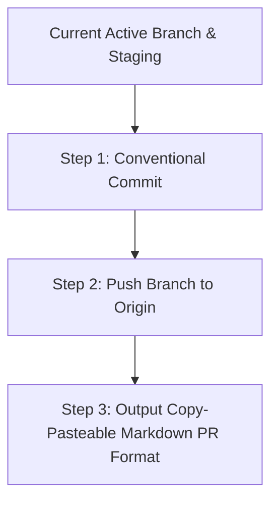

# GitHub Pull Request Generator Skill

This skill documents the mandatory end-to-end standard operating procedure for preparing, structuring, formatting, and generating copy-pasteable Markdown Pull Requests for the GEMMA Plugin repository and related sub-packages.

---

## Core Policy: Copy-Paste Generation (No Auto-PR Submission)

Do **NOT** attempt to automatically create or submit Pull Requests directly via API tools or CLI calls unless the user explicitly requests automatic submission.

Instead, the agent must:
1. Stage, commit, and push the local branch changes to `origin`.
2. Generate and present the complete **PR Title** and **PR Description** inside clean, copy-pasteable GitHub-flavored Markdown code blocks so the user can paste them directly into GitHub.

---

## Workflow Overview



---

## Step 1: Conventional Commit Protocol

All commits must strictly follow Conventional Commits formatting:

```text
<type>(<scope>): <short summary in imperative present tense>

<optional detailed explanation of problem, rationale, and technical solution>
```

**Types:** `feat`, `fix`, `docs`, `style`, `refactor`, `perf`, `test`, `chore`, `ci`, `build`

```bash
git add <files>
git commit -m "fix(release): extract release-specific contributors for VitePress changelogs" -m "Extract GitHub user attributions directly from release changelog items instead of falling back to global git log."
```

---

## Step 2: Push to Remote Repository

Push the current active branch to `origin`:

```bash
git push origin <current-branch>
```

---

## Step 3: PR Markdown Output Standard

Format the **PR Title** and **PR Description** inside separate Markdown code blocks for instant copy-pasting by the user.

### Mandatory PR Structure

1. **Title Code Block:** Conventional Commit title string (e.g., `fix(release): extract release-specific contributors for VitePress changelogs`).
2. **Summary:** 1–3 sentence high-level overview of what the PR accomplishes.
3. **Problem / Rationale:** Explanation of why the bug occurred or why the feature was needed.
4. **Key Changes:** Grouped list of changes per component using repository relative file paths (e.g., `scripts/utils/changelog.py`).
5. **Verification:** Steps taken and empirical commands executed to verify the fix.


