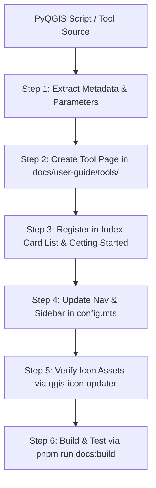

# QGIS Tool Documentation Generator Skill

This skill documents the mandatory end-to-end workflow for authoring, structuring, registering, and building documentation pages for QGIS tools within the GEMMA VitePress documentation site (`docs/user-guide/`).

---

## 📋 Full Documentation Generation Protocol



---

## 🛠️ Step-by-Step Execution Guide

### Step 1: Extract Source Metadata from PyQGIS Script
Inspect the Python Processing Algorithm (`gmd_scripts/<script_name>.py`) and extract:
- `displayName()`: User-visible tool title.
- `group()` / `groupId()`: Toolbox category.
- `name()`: Algorithm ID string (`gmd_pipeline:<id>`).
- `icon()`: Associated SVG icon basename (`<icon_name>.svg`).
- `shortHelpString()`: High-level algorithm explanation.
- `initAlgorithm()`: Inputs, parameters, options, and output sinks.

---

### Step 2: Create Tool Markdown Page
Create the tool guide at `docs/user-guide/tools/<tool-slug>.md`.

#### Standard Template Structure:

```markdown
# .svg" width="32" height="32" style="vertical-align: middle; display: inline-block; margin-right: 8px;" /> Tool Title

The **Tool Title** tool [Brief 1-2 sentence description of what the tool accomplishes and its core GIS value proposition].

## Access

- **Processing Toolbox:** GMD Pipeline → [Group Name] → [Tool Title]
- **Algorithm ID:** `gmd_pipeline:<algorithm_id>`

## When to Use

Use this tool when:
- [Scenario 1: Common use case or data problem]
- [Scenario 2: Data quality requirement]
- [Scenario 3: Specific pipeline stage]

## Parameters

### Inputs

| Parameter | Type | Description |
|-----------|------|-------------|
| **Input Layer** | Feature Source ([Geometry Type]) | The input vector layer to process |
| **[Parameter Name]** | [Data Type / Enum / File] | [Clear parameter explanation and default behavior] |

### Outputs

| Output | Type | Description |
|--------|------|-------------|
| **Output Layer** | Feature Sink ([Geometry Type]) | The resulting output layer |

## How It Works

1. **[Step 1 Title]**:
   - [Explanation of underlying spatial operations, auto-detection, or algorithm steps]

2. **[Step 2 Title]**:
   - [Detailed processing logic or math formulas (use LaTeX `$$...$$` if applicable)]

3. **[Step 3 Title]**:
   - [Output feature generation, field transfer, and layer creation]

## Supported Geometry Types

- **Point** and **MultiPoint**
- **LineString** and **MultiLineString**
- **Polygon** and **MultiPolygon**

::: tip
[Helpful user tip or performance shortcut]
:::
```

---

### Step 3: Register in Index Card Grid (`docs/user-guide/index.md`) & Getting Started (`docs/user-guide/getting-started.md`)

#### 3.1 Register in Index Card Grid (`docs/user-guide/index.md`)
Open `docs/user-guide/index.md` and add the card entry under the appropriate category section:

```yaml
  - icon:
      src: /icons/<icon_name>.svg
    title: Tool Title
    details: [1-sentence concise description of what the tool does].
    link: /tools/<tool-slug>
    linkText: View Guide
```

#### 3.2 Register in Getting Started Page (`docs/user-guide/getting-started.md`)
Open `docs/user-guide/getting-started.md` and add the tool link and description under the matching category table (`Processing Toolbox — GMD Pipeline`, `Gemma Menu — Tools`, or `Gemma Menu — QField`):

```markdown
| [Tool Title](/tools/<tool-slug>) | [1-sentence concise description of what the tool does] |
```

---

### Step 4: Register Navigation & Sidebar (`docs/.vitepress/config.mts`)
Open `docs/.vitepress/config.mts` and update both the `nav` items dropdown and `sidebar` list:

```typescript
// Inside nav -> Tools -> [Category Items]
{ text: 'Tool Title', link: '/tools/<tool-slug>' },

// Inside sidebar -> /tools/ -> [Category Sidebar Group]
{ text: 'Tool Title', link: '/tools/<tool-slug>' },
```

---

### Step 5: Verify Icon Assets
Follow the **`qgis-icon-updater`** skill protocol to ensure `/icons/<icon_name>.svg` is present in:
1. `icons/<icon_name>.svg`
2. `docs/user-guide/public/icons/<icon_name>.svg`

---

### Step 6: Build & Verify
Run the VitePress build command to ensure zero compilation or missing import errors:

```bash
pnpm run docs:build
```
