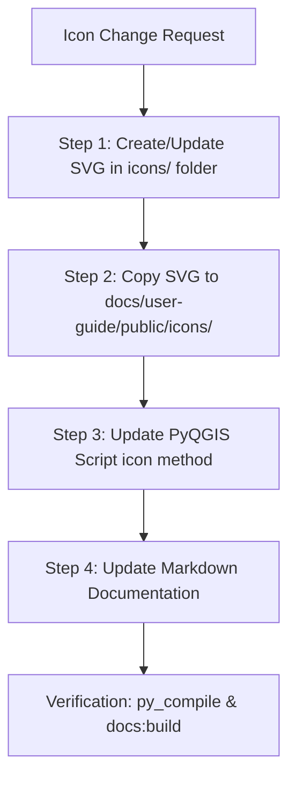

# QGIS Icon Update & Synchronization Protocol

This skill documents the mandatory end-to-end workflow for creating or updating tool icons/logos within the GEMMA QGIS plugin repository.

When an icon for any QGIS tool or script algorithm is created or modified, **all 4 synchronized locations** must be updated to prevent runtime UI fallbacks or VitePress documentation build errors.

---

## What to Update: The 4-Step Icon Sync Flow



---

### Step 1: Create or Update SVG Icon in Plugin Icons Directory
* **Target Location:** `icons/<icon_name>.svg`
* **Design Standards:**
  * **ViewBox:** `viewBox="0 0 24 24"` (Native 24x24 Qt/QGIS action grid).
  * **Canvas:** 100% transparent background (NO background `<rect>`, box shadow, or framing square).
  * **Color Palette & Visual Contrast Rules:**
    * **High Contrast (Light & Dark Theme Visibility):** Use vibrant, high-luminosity dual-tone strokes (`1.8px` width) with semi-transparent tinted geometry fills (`fill-opacity="0.15"`). Ensure icons are easy to distinguish and clearly visible on both Light and Dark UI themes. Never rely on single dark line-art alone.

---

### Step 2: Copy SVG to VitePress Public Asset Directory
* **Target Location:** `docs/user-guide/public/icons/<icon_name>.svg`
* **Purpose:** VitePress resolves static assets specified as `/icons/<icon_name>.svg` from the public directory defined by `srcDir: "user-guide"`. Missing SVG assets in this folder will crash `pnpm run docs:dev` / `pnpm run docs:build`.

---

### Step 3: Update `icon(self)` Method in PyQGIS Scripts & Algorithms
> [!NOTE]
> Scripts in `cbms_mv/` (`gmd_scripts/cbms_mv/`) and `deprecated/` are excluded from the mandatory icon synchronization protocol.

* **Target Locations:** 
  * `gmd_scripts/<script_name>.py` (Scripts in `gmd_scripts/`, excluding `cbms_mv/` and `deprecated/`)
  * `references/<tool_name>/algorithm.py`, `provider.py`, `plugin.py`, `dialog.py` (Subdirectory algorithms)
  * `gmd_pipeline.py` (Central toolbar/menu icon registry)
* **Implementation Standards:**
  * **Direct Scripts (`gmd_scripts/`):** Use `os.path.dirname(os.path.dirname(__file__))` to reach the root `icons/` folder:
    ```python
    import os
    from qgis.PyQt.QtGui import QIcon

    def icon(self):
        icon_path = os.path.join(os.path.dirname(os.path.dirname(__file__)), 'icons', '<icon_name>.svg')
        if os.path.exists(icon_path):
            return QIcon(icon_path)
        return QIcon(":/images/themes/default/mActionFilter.svg")
    ```
  * **Nested Subdirectory Modules (`references/<tool>/`):** Navigate up two levels (`"..", ".."`):
    ```python
    import os
    from qgis.PyQt.QtGui import QIcon

    def icon(self):
        icon_path = os.path.abspath(
            os.path.join(os.path.dirname(__file__), "..", "..", "icons", "<icon_name>.svg")
        )
        if os.path.exists(icon_path):
            return QIcon(icon_path)
        return super().icon()
    ```
  * **Central Menu Registry (`gmd_pipeline.py`):** Update QIcon paths to point to `.svg` assets:
    ```python
    tool_icon = QIcon(os.path.dirname(__file__) + "/icons/<icon_name>.svg")
    ```

---

### Step 4: Update VitePress Documentation Pages
* **Tool Detail Page (`docs/user-guide/tools/<tool-slug>.md`):**
  Update the header icon image tag:
  ```markdown
  # .svg" width="32" height="32" style="vertical-align: middle; display: inline-block; margin-right: 8px;" /> Tool Title
  ```
* **Tools Index Page (`docs/user-guide/index.md`):**
  Update the card icon reference:
  ```yaml
    - icon:
        src: /icons/<icon_name>.svg
      title: Tool Title
  ```

---

## Verification Protocol

Before completing any icon update task, run these verification commands:

1. **Validate Python Script Syntax:**
   ```bash
   python -m py_compile gmd_scripts/<script_name>.py
   ```
2. **Validate VitePress Documentation Build:**
   ```bash
   pnpm run docs:build
   ```
